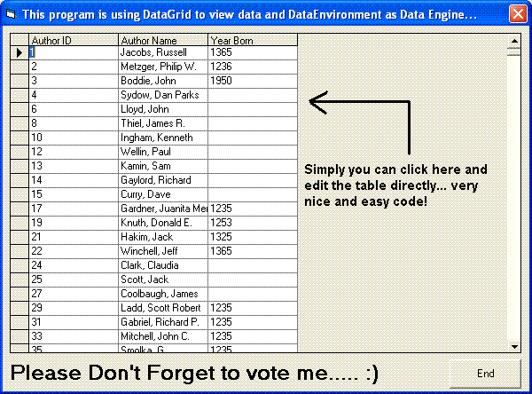



## Using DataGrid Control to view data and DataEnvironment Control as data engine

### Description

Using DataGrid Control and DataEnvironment Control:

----

This program is using DataGrid to view data and DataEnvironment as Data Engine... Easy and nice!

Please don't forget to vote....

Thank you
 
### More Info
 
Data Base Input

Data View

             |
---                |---
**Submitted On**   |2006-01-14 13:53:38
**By**             |[Ahmad Eissa](https://github.com/Planet-Source-Code/PSCIndex/blob/master/ByAuthor/ahmad-eissa.md)
**Level**          |Advanced
**User Rating**    |4.3 (13 globes from 3 users)
**Compatibility**  |VB 5\.0, VB 6\.0
**Category**       |[Databases/ Data Access/ DAO/ ADO](https://github.com/Planet-Source-Code/PSCIndex/blob/master/ByCategory/databases-data-access-dao-ado__1-6.md)
**World**          |[Visual Basic](https://github.com/Planet-Source-Code/PSCIndex/blob/master/ByWorld/visual-basic.md)
**Archive File**   |[Using\_Data1965141142006\.zip](https://github.com/Planet-Source-Code/ahmad-eissa-using-datagrid-control-to-view-data-and-dataenvironment-control-as-data-engine__1-64034/archive/master.zip)

